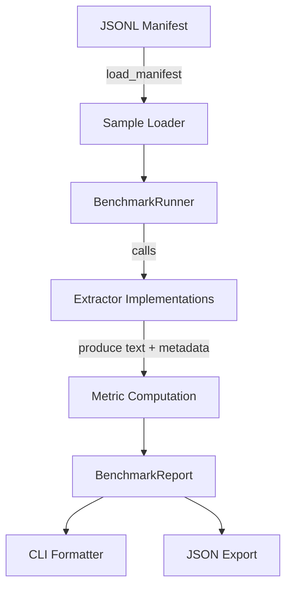
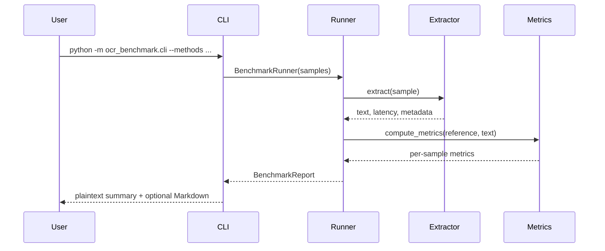

# OCR Benchmark Suite

This repository contains a lightweight OCR benchmarking harness built around a
small, self-contained sample inspired by the [OmniDocBench](https://huggingface.co/datasets/opendatalab/OmniDocBench) benchmark. The suite is
modular so that you can compare AWS Textract against other OCR back-ends with
consistent metrics and reporting.

## Repository layout

```
ocr_benchmark/
  cli.py              - Command line interface
  data_loader.py      - Utilities for reading JSONL manifests
  evaluator.py        - Metric aggregation and benchmarking orchestration
  metrics.py          - Character/word error rates and related metrics
  models/             - OCR extractors (Textract + plaintext baseline)
  reporting.py        - Helpers for textual/markdown summaries

## Design overview





data/omnidoc_sample/
  manifest.jsonl      - Three-sample OmniDoc-style manifest
  docs/               - Reference transcriptions used by the plaintext baseline
```

## Getting started

1. (Optional) Create a virtual environment and install dependencies:

   ```bash
   pip install boto3
   ```

   `boto3` is only required if you plan to run the Textract extractor. The
   plaintext baseline ships with the standard library only.

2. Run the benchmark on the included sample using the plaintext baseline:

   ```bash
   python -m ocr_benchmark.cli --manifest data/omnidoc_sample/manifest.jsonl \
       --methods plaintext --markdown
   ```

   This will print both a human-readable summary and a Markdown table of the
   aggregated metrics. The plaintext extractor simply reads the reference
   transcription files and should therefore achieve perfect scores. The example
   is intended as a quick sanity check that the suite is wired correctly.

3. Evaluate Textract (requires AWS credentials with Textract permissions):

   ```bash
   python -m ocr_benchmark.cli --methods textract --textract-region us-east-1 \
       --textract-profile benchmark-user \
       --manifest path/to/your/omnibook_subset/manifest.jsonl --markdown \
       --output-json textract-results.json
   ```

   The CLI supports both the `detect_document_text` and `analyze_document`
   Textract APIs. Use the `--textract-mode` and `--textract-feature-types`
   arguments to control this behaviour.

### Configuring AWS credentials

Textract authentication is handled by `boto3` and follows the
[standard AWS credential resolution chain](https://boto3.amazonaws.com/v1/documentation/api/latest/guide/credentials.html):

- Environment variables such as `AWS_ACCESS_KEY_ID`, `AWS_SECRET_ACCESS_KEY`,
  and `AWS_SESSION_TOKEN`.
- Shared credentials files (`~/.aws/credentials`) and config files
  (`~/.aws/config`). Use the `--textract-profile` flag to select a named
  profile from these files.
- IAM roles attached to the runtime environment (for example, EC2 or Lambda).

No credentials need to be stored in this repository. Configure them once using
the AWS CLI or environment variables, then invoke the benchmark CLI. For
example, to run with the default profile defined by `aws configure` you can
omit `--textract-profile`; to target a specific profile, pass its name via the
flag as shown above.

4. Add additional OCR systems by subclassing `BaseExtractor` (see
   `ocr_benchmark/models/base.py`). New extractors can be wired into the CLI by
   extending `_build_extractor` in `ocr_benchmark/cli.py` or by importing the
   benchmarking primitives directly in your own scripts.

## Metrics

For every sample the suite records:

- **Character Error Rate (CER)** – edit-distance normalised by the number of
  characters in the ground truth.
- **Word Error Rate (WER)** – edit-distance over tokenised words.
- **Token precision/recall/F1** – bag-of-words overlap between the reference
  and hypothesis tokens.
- **Exact match** – 1 if the normalised hypothesis matches the reference, else 0.
- **Average Textract confidence** (when available).
- **Latency** (per sample and aggregated mean).

Aggregated metrics are exposed per method alongside optional metadata
(including average confidence and run timestamp). Full results can be exported
as JSON via the `--output-json` flag.

## Using a larger OmniDocBench subset

Replace `data/omnidoc_sample/manifest.jsonl` with a manifest pointing to the
OmniDocBench pages you want to evaluate. A convenient way to curate a subset is
to load OmniDocBench via the `datasets` library, inspect the available fields,
select the samples you need, and serialise their metadata to JSONL. For
example:

```bash
pip install datasets Pillow
python - <<'PY'
import json
from pathlib import Path
from datasets import load_dataset

dataset = load_dataset("opendatalab/OmniDocBench", split="validation")

# Adapt the feature names below to match the fields printed by dataset.features
print(dataset.features)

subset = dataset.shuffle(seed=42).select(range(25))

image_dir = Path("images")
image_dir.mkdir(parents=True, exist_ok=True)

with open("manifest.jsonl", "w", encoding="utf-8") as fp:
    for example in subset:
        image = example["image"]
        
        if isinstance(image, dict) and image.get("path"):
            source_path = image["path"]
        elif isinstance(image, dict) and image.get("bytes"):
            filename = f"{example['id']}.png"
            destination = image_dir / filename
            destination.write_bytes(image["bytes"])
            source_path = str(destination)
        else:
            filename = f"{example['id']}.png"
            destination = image_dir / filename
            image.save(destination)
            source_path = str(destination)

        fp.write(
            json.dumps(
                {
                    "id": example["id"],
                    "source": source_path,
                    "ground_truth": example.get("text") or example.get("ground_truth"),
                    "metadata": {
                        "source_dataset": "opendatalab/OmniDocBench",
                        "split": "validation",
                        "document_type": example.get("doc_type"),
                    },
                }
            )
            + "\n"
        )
PY
```

The command above writes PNGs into an `images/` directory next to the manifest
and references them via relative paths. Adjust `image_dir` or relocate the
manifest as needed for your storage layout. If the dataset exposes different
field names (for example, `ocr_text` instead of `text`), update the dictionary
access accordingly.

Feel free to inline `ground_truth` directly, as above, or reference files with
`ground_truth_path`. The manifest follows a JSONL structure:

```json
{"id": "example", "source": "relative/path/to/image.png", "ground_truth_path": "relative/path/to/ground_truth.txt", "metadata": {"document_type": "invoice", "language": "en"}}
```

- `source` is the path to the page image (PNG/JPEG/PDF bytes) relative to the
  manifest file.
- Provide either an inline `ground_truth` string or a `ground_truth_path`.
- Additional fields are stored under `metadata` and propagated to the reports.

## Extending the benchmark

- Plug in further OCR methods by subclassing `BaseExtractor`.
- Customise metric computation by importing `compute_metrics` directly or by
  adding new aggregation logic to `ocr_benchmark/metrics.py`.
- The reporting helpers in `ocr_benchmark/reporting.py` make it easy to produce
  Markdown or plaintext summaries for dashboards and documentation.

## License

The included sample files are synthetic transcriptions designed to mimic the
structure of OmniDocBench pages. Refer to the upstream OmniDocBench dataset for
licensing information when benchmarking against the full corpus.
